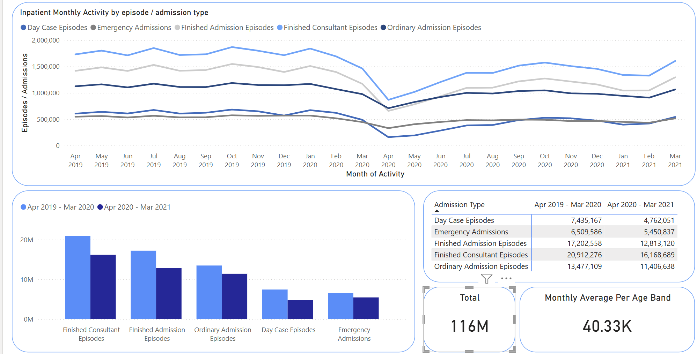

# Recreating a Dashboard in PowerBI
In this workhsop we will be taking inspiration from a published NHS PowerBI Dashbpard. 

`

https://digital.nhs.uk/dashboards/activity-in-nhs-hospitals

We will make a few ammendments and add bar charts and call out cards.

`

# Step 1 - Download the data
Download hospital_activity_data.csv from this repo\
The data can also be downloaded directly from:\
https://files.digital.nhs.uk/B1/D9317B/HES_M8_OPEN_DATA_AGE_GROUPS.csv

**_NOTE:_** This data is not in the best form for analysis with PowerBI. \
Initially we will use as is, then we will transform using PowerQuery including unpivoting some columns.

# Step 2 - New report
Open up PowberBI and select `Blank report`

`

# Step 3 - Import the data
Select: 
1.  Down arrow on `Get data` then 
1.  `Text/CSV` from the sub menuThe navigate to the the downloaded hospital_activity_data.csv 

`

A PowerQuery Window will now open giving you an overview of the data.This data is clean and we can directly 
1.  `Load` the data 
Even though we know the data is clean it is a good idea to view the data, have a look through the columns and ensure you dont see any obvious errors.

`

You will see that the file appears on the far right Data Panel Select: 
  1.  The down arrow to the left of the file to expand and view all columns 

The columns with:
* Σ denote that they are numerical
* Calendar Icons denote they are dates
* No icon before Age_Band deontes it being intrepreted as Text

`

# Step 4 - First Visual - Line Chart
Select  
1. Line chart from the Visualisations Panel

`

This will create a placeholder for the chart in the main canvas. 

`

We will add the fields from the data panel and drag them to the visualistaion panel.

For the X-axis, drag in:\
&nbsp;&nbsp;&nbsp;&nbsp; Month_ending

For the Y-axis drag in:
* FAE
* Emergency
* FCE
* FCE_DAY_CASES
* Ordinary_Admission_Episodes 

The default aggregation for numerical columns is Sum and this is what we are going to use.

`

Resize the visual occupy the top half of the canvas 

`

There are many things that need to be formatted in this visual to match the published example we are recreating

`

`

* Title
* Outline
* Axis Labels
* Line Colours
* Legend
* Y-axis Values Formatting
* Number Formatting
* Monthly View
* X-axis Range
* X-axis Values Formatting

Of this list, the easiest thing to address is the `Title` and the most difficult is the `X-Axis` Values Formatting.

## Title
 1. Select `Format Visuals` in the `Visualisations` panel 
 1. Select the `General` Tab 
 1. Select `Title` and rename to `Inpatient Monthly Activity by episode / admission type`

`

## Outline
Ensure you have the Line chart Selected in the main canvas then: 
1. Select `Format Visuals` in the `Visualisations` panel 
1. Select the `General` Tab 
1. Select the `Effects` Tab 
1. Turn on `Visual Border`, select light blue from for the colour and round the corners to 30 pixels

`

## Axis Labels
Ensure you have the Line chart Selected in the main canvas then: 
1. Select `Format Visuals` in the `Visualisations` panel 
1. Select the `Visual` Tab 1. Select the `Title` Tab 
1. Change the text to `Month of Activity` (none of the data is provisional now)

Repeat the same steps for the Y-axis labelling it `Episodes / Admissions`

`

## Colours
Ensure you have the Line chart Selected in the main canvas then: 
1. Select `Format Visuals` in the `Visualisations` panel 
1. Select the `Visual` Tab 1. Select the `Lines` Tab 
1. Select the Series you wish to edit in the `Series` dropdown and chose the colour from the quick list displayed 

Repeat this for all other lines

`

## Legend
Ensure you have the Line chart Selected in the main canvas then: 
1. Select `Build Visual` in the `Visualisations` panel 
1. In the Y-axis section, select the arrow to the right of a field to get it's menu 
1. Select `Rename for this visual` and adjust accordinglyRepeat this for all other lines

`

## Y-axis Values Formatting
Ensure you have the Line chart Selected in the main canvas then:
 1. Select `Format Visual` in the `Visualisations` panel
 1. Expand the Y-axis section, select `Display units` and set to `None`
 1. Select `Display units` and set to `None`

`

## Number Formatting
 1. Select `Table View` in the far left panel
 1. Select the `FCE` column 
 1. Select the COMMA icon in the `Formatting` pane of the `Column tools` Menu

This adds commas to the number display. Go back to the report view and see how it changes the formatting for this series only in the tool tip.The tool tip is what it displayed when you hover the cursor over the line chart. It will respond dynamically to where the curosor is on the graph.

Return to the `Table view` and repeat for all columns used in the display.Once finished, this will now change the formatting on the Y-axis

`

## Monthly View
 1. Select `Report view` if you are not there 
 1. Select `Expand all down one level` Until you have the monthly view

Monthly view is the most granular level of our Data as it is recorded as month end.

`

## X-axis Range
Ensure you have the Line chart Selected in the main canvas then: 
1. Select `Format Visual` in the `Visualisations` panel* 
1. Expand the X-axis section 
1. Set the Range from 01/04/2019 to 31/03/2021*Note how the Data Type for the X-axis is continuous

**_NOTE:_**  Change the `Type` to categorical and see that you cannot limit the range anymore. \
To revert select `Reset to default` at the bottom of all X-axis options.

`

Our charts are now very close. However, we still some issues:
* X-axis not the same
* Charts look different at extremes
* Tool tips display differently

##### Ours

`

##### Target

`

## X-axis Values Formatting

In order to format the X-axis exactly as the example we will need to:
* Restrict the range of the data as the X-axis needs to be categorical*
* Create a new column with the month, as 3 letters, and the year
* Sort this by the original month end column
* Make this column the new X-axis

*When a column is categorical we cannot restrict the range as we did before in the `Format Visual` panel

## Restrict Range

 1. Select `Table View` in the far left panel 
 1. Select the `Home` tab 1. Select `Transform Data` 
 1. Select `Transform Data`

**_NOTE:_** We will now be performing transformations in PowerQuery.

`

A Power Query Window will open 
1. Select the `Filters` button on the Month_Ending` column 
1. Select `Date Filters` and choose `Between` in the sub menu

`

 1. In the pop up dialogue window enter the range 30/04/2019 to 31/03/2021

`

While in PowerQuery we can streamline our pipline. \
1. Remove any columns that we are not using
1. Rename columns, these names will be the defaults for all visuals

 1. Select `Close & Apply`

`

The changes will now take effect.

## Create column for Abbreviated Month and Year

 1. Select `Table View` in the far left panel 
 1. Select `New Column`, you should be in `Column tools` by default 
 1. Enter `Short_Month = FORMAT([Month_Ending], `MMM yyyy`)` as the calculation**Note how this column is interpreted as Text and not Date, this will change how the axis is displayed.

`

 1. Select the newly created `Short_Month` column  
 1. Select `Sort by column` 
 1. Select `Month_ending`

`

## Assigning to the X-axis

 1. Select `Report View` in the far left panel 
 1. Deselest `Month_Ending` 1. Select `Short Month` 
 1. Note how it updates in the X-axis 
 1. Note how the X-axis formatting changes

`

Your Chart should now be very similair to the example. \
The tool tips shoulld display properly as well as the correct format for the X-axis\

Ours
`

Target
`

## Step 5 - Add the Slicer

Ensure you have Selected white Space in the main canvas then: 
1. Select `Build Visual` in the `Visualisations` panel 
1. Select `Slicer` from the choarts menu 
1. Add `Age_Band` to `Field` 
1. Rename to `Age Breakdown`

`

 1. Select `Format Visual` in the `Visualisations` panel 
 1. Select `Dropdown` from the `Style` menu in `Slicer Settings`

`

Resize and move the visuals to match the target dashboard. \
Experiement with the Slicer and note the format of the data within.

`

## Step 6 - Summary Table (Matrix)

`

### Step 6a - Data Prep

Firstly, to explore another way to change the name of fields on the display, we will change the name of the columns in `Data view`.\
 Changes made here will affect all visuals that the columns are involved in.\
  (We are doing this instead of renaming the fields for the specific visual as we did before)

 1. Select `Data View` in the far left panel 
 1. Right click, or double click on a column you wish to rename.
 1. Enter the new name, and continue for all relevant columns, these will be the columns with `commas` that you inserted before

 **_Note_** Column names: 
 * Finished Consultant Episodes
 * Ordinary Admission Episodes
 * Day Case Episodes
 * Finished Admission Episodes
 * Emergency Admissions

 Secondly we will create a column for `Fiscal Month and Year`

 1. Ensure you are in `Data View`
 1. Select `Add column`
 1. Enter the dax code:
    `Fiscal Month & Year = FORMAT([FY_Start_Date], "MMM YYYY") & " - " & FORMAT([FY_End_Date], "MMM YYYY")`
1. Observe the newly created column

`

### Step 6b - Unpivoting Columns

The data in its raw from as supplied needs some transformation in order to create some other charts. \

**_NOTE:_** Add a Clustered Bar chart to the cavas and see that we cannot get it to display correctly with the current data

We need to "unpivot" some columns to it into the right form. \
This will break our line chart, but it can be easily fixed. 

1. Select `Transform data` from the top bar

1. In the power query window hold `ctrl` and select the 5 columns we are working with
  1. Finished consultant episodes
  1. Ordinary Admission Episodes
  1. Day Case Episodes
  1. Finished Admission EPisodes
  1. Emergency Admissions
1. Select the `Transform` Tab
1. Select `Unpivot Columns`

`

This will collapse the 5 columns into two, one called `Attribute` and another called `Value`.\

Rename the columns to `Admission type` and `Total` \
To remane you can right click on the column header and select `Rename` Or \
1. Select `Rename` from the top menu in the `Transform` Tab

`

Once you are finished 
1. Select the `Home` Tab and  
1. `Close & Apply`

`

As we have removed the columns that the line chart was built on this chart will now show an error. \
This is easy to fix.
1. Ensure you are on the `canvas` view
1. Deselect all of the fields in the Y-axis and add the new `Total` column to the Y-axis
1. Add the new `Admission Type` to the `Legend`

`

The colours of the lines will have to be fixed again, a comma should be added to the totals column and the title of the legend should be removed. \
This reformatting is left as an exercise. 

`

`

### Step 6b - Creating Summary Table(Matrix)

1. Add a `Matrix Chart`
1.  Add the newly created `Admission Type`column to the `Row` field 
1. Add the newly created `Fiscal Month and Year` to the `Column` field
1. Add `Total`to the `Values` field

`

1. Row and column Subtotals can be toggled off in the `Format Visual` tab

`

Give the visual an outline as before, resize and move.

**_Note_** Notice how selecting cells, column and row headers affects the line chart.

## Step 7 - Clustered Bar Chart

Select Empty Space on the Canvas and:
1. Select `Clustered column chart` from th `Build visual` tab
1. Add `Admission Type` to the X-Axis
1. Add `Fiscal Month and Year` to the `Columns` field
1. Add `Total` to the `Values` field.

Resize the image, add an outline and remove legend and axis titles. \
This is left as an exercise.

`

## Step 8 - Call out cards

We will create two call out cards, one with the Total and the other with Monthly Average per Age band

Ensure you have selected white space on the canvas then:
1. Select `Card` from `Build visual`
1. Add `Total` column to `Fields`

`

1. Turn off `Category Label` in `Visual` under `Format visual`

`

1. Add a title and format to your liking

`

Resize, add an outline

Repeat the above for the second card except 

1. Select `Average` when adding to `Fields`

`

Resize and arrange

`

## Finally... add a Title!!

 1. Select `Insert` from the top left 
 1. Select `Text Box`

`

 1. Set the font to Verdana, Size 14 and Bold
 1. Enter the title `Monthly HES data for Admited Patient Care by Age Band`

`

Center the Title

# Well Done!!!

